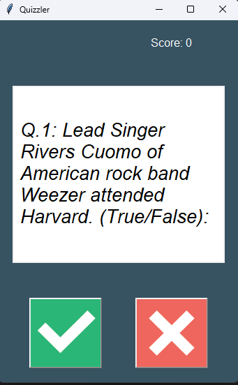
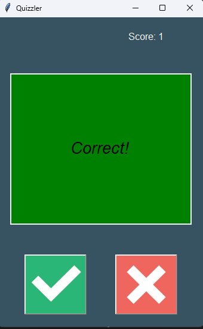
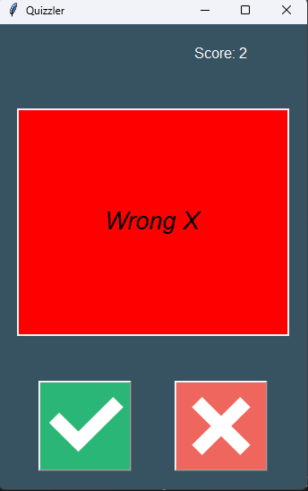

# Quizzler — A Tkinter-Powered Quiz App
A simple quiz game built with Python and tkinter, powered by trivia questions from the Open Trivia Database. It features multiple categories, difficulties, and question types, and uses a clean GUI to test your knowledge.

------------
## Features
✅ Interactive UI with True/False buttons

✅ Dynamically fetches questions from an online API

✅ Auto-updating score and feedback per answer

✅ Color feedback for correct/incorrect answers

✅ Support for question customization (amount, type, difficulty, category)

-------------------
## 🧰 Technologies Used
- Python 3.10+
- tkinter (GUI)
- requests (API calls)
- Enum (for clean question parameter control)
------------

## Project Structure
```ini
quizzler-app/
│
├── main.py               # Entry point
├── quiz_brain.py         # Quiz logic (provided)
├── ui.py                 # GUI logic (you built)
├── data.py               # Class to fetch questions from OpenTDB
├── images/               # Contains true.png and false.png
└── README.md             # This file
```
-------------

## How It Works
### GenerateQuestions (in data.py)
Handles fetching trivia questions from the OpenTDB API:

```python
question_data = GenerateQuestions(
    num_of_questions=10,
    question_type=QuestionType.TRUE_FALSE,
    category=Category.MUSIC,
    difficulty=Difficulty.EASY
).get_questions()
```
----
## QuizBrain (provided)
#### Handles:
- Question queue
- Current question logic
- Scoring
- Answer validation

#### QuizInterface (in ui.py)
- Displays questions on a tkinter.Canvas
- Binds buttons to answer-checking logic
- Shows score and provides real-time feedback

----

## Getting Started
1. Clone the repo:
```bash
    git clone https://github.com/your-username/quizzler-app.git
    cd quizzler-app
```
2. Install dependencies:
```bash
    pip install requests
```
3. Make sure you have the images/ folder with:
- true.png
- false.png

4. Run the app:
```bash
    python main.py
```
----
## Customization Options
You can change the behavior of the quiz in main.py by adjusting the GenerateQuestions call:
```python
GenerateQuestions(
    num_of_questions=5,
    question_type=QuestionType.MULTIPLE_CHOICE,
    category=Category.FILM,
    difficulty=Difficulty.HARD
)
```
Available options are defined in enums:

### Categories
```python
Category.GENERAL_KNOWLEDGE
Category.MUSIC
Category.VIDEO_GAMES
# etc.
```

### Difficulties
```python
Difficulty.EASY
Difficulty.MEDIUM
Difficulty.HARD
```

### Question Types
```python
QuestionType.TRUE_FALSE
QuestionType.MULTIPLE_CHOICE
```

## 📸 Screenshot 
 |  | 

## Notes
- Make sure you're connected to the internet to fetch questions from the API.
- You can extend the app to support OpenTDB sessions, category dropdowns, or multiplayer logic.